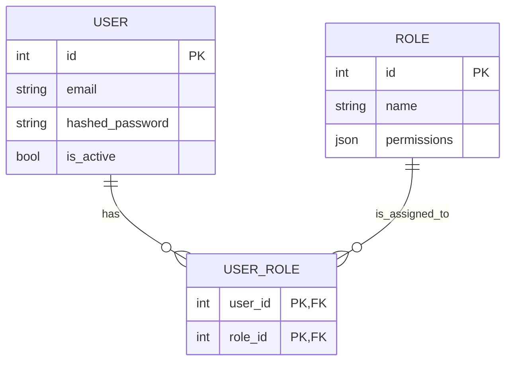

# Architecture Overview

This document describes the overall architecture of the AI-Powered Attendance & HRMS Platform.

## Guiding Principles

*   **Microservices:** The backend is designed as a set of independent microservices, each responsible for a specific domain (e.g., auth, attendance, hrms, payroll). This promotes scalability, maintainability, and independent deployment.
*   **Modularity:** Each component (service, frontend, mobile app) is developed to be as self-contained as possible.
*   **Containerization:** Docker is used for containerizing all services, ensuring consistent environments from development to production.
*   **Scalability:** The architecture is designed to scale horizontally by running multiple instances of each microservice.
*   **Clean Code & Best Practices:** Adherence to industry best practices for code quality, testing, and security.

## High-Level Components

1.  **Backend Services (`services/`)**
    *   Built with FastAPI (Python).
    *   Each service has its own PostgreSQL database (or schema).
    *   Communicate via REST APIs or a message broker (e.g., RabbitMQ, Kafka - TBD).
    *   Services:
        *   `auth/`: Authentication, Authorization, User Management, Roles, Licensing, Subscription.
        *   `attendance/`: Core attendance logic, AI face recognition, shift management, rule engine.
        *   `hrms/`: HR Management (Employee data, Leave, PMS, Onboarding/Offboarding, LMS, ATS, Travel).
        *   `payroll/`: Payroll processing, salary calculation, compliance.
        *   _(Potentially other services like `travel/` if split from HRMS)_

2.  **Web Client (`web-client/`)**
    *   React (with Vite) and TailwindCSS.
    *   Single Page Application (SPA).
    *   Communicates with backend services via REST APIs.

3.  **Mobile App (`mobile-app/`)**
    *   React Native for iOS and Android.
    *   Communicates with backend services via REST APIs.

4.  **Databases**
    *   PostgreSQL for primary data storage for each microservice.
    *   Redis for caching, session management, and potentially as a message broker for Celery.

5.  **AI Modules**
    *   Integrated within relevant services (e.g., face recognition in `attendance/`).
    *   Utilize libraries like OpenCV, TensorFlow/PyTorch, EasyOCR.

6.  **Infrastructure (`infra/`)**
    *   Docker Compose for local development and multi-container orchestration.
    *   Kubernetes (K8s) manifests for production deployment orchestration (optional, for self-hosting at scale).
    *   Terraform/CloudFormation for AWS infrastructure provisioning.
    *   Monitoring stack (Prometheus, Grafana).

## Data Flow (Example: Attendance Punch)

1.  User attempts to punch in via Mobile App or Web Kiosk.
2.  App captures image/frame.
3.  Request sent to `attendance-service` (`/attendance/punch`).
4.  `attendance-service` uses its AI module:
    *   Detects face.
    *   Generates embedding.
    *   Matches embedding against stored embeddings in its PostgreSQL DB.
5.  If matched, an `AttendanceRecord` is created.
6.  Response sent back to the client.

## ER Diagrams (Mermaid Syntax - Placeholder)

(Detailed ER diagrams for each service will be added here or in service-specific documentation)

### Auth Service (Simplified)

## Future Considerations
*   API Gateway (e.g., Kong, Traefik, AWS API Gateway) for managing external API traffic.
*   Centralized logging (e.g., ELK stack).
*   Service discovery.
